# VMware Cloud Foundation (VCF) 5.x in a Box

Deploy a fully functional VMware Cloud Foundation (VCF) 5.x environment running on a single physical ESXi host for development and lab purposes, with the goal of being able to explore and learn about VCF using a minimal amount of compute and storage resources.

**Note:** This is not using Nested ESXi such as the [VCF Holodeck Solution](https://williamlam.com/2023/03/self-contained-automated-vmware-cloud-foundation-vcf-deployment-using-new-vlc-holodeck-toolkit.html)

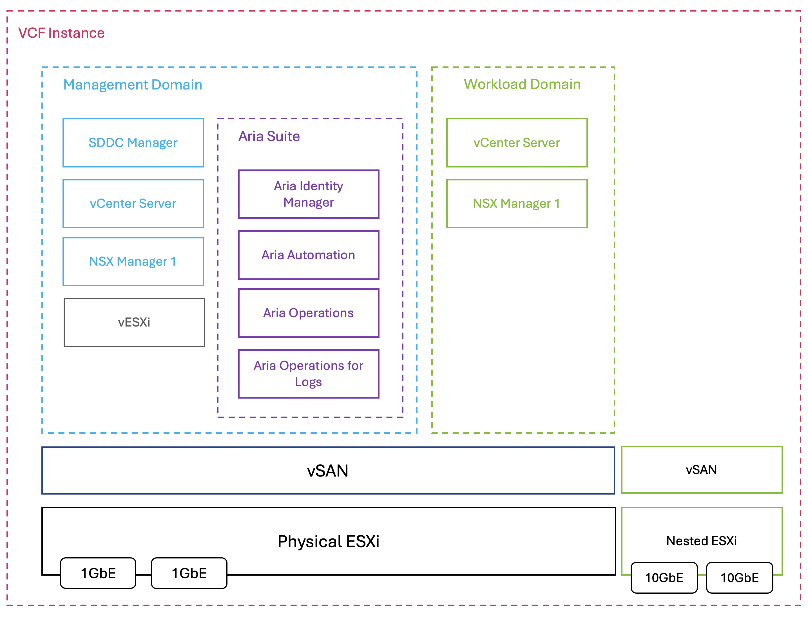

## Table of Contents

* [Changelog](#changelog)
* [Build of Materials (BOM)](#build-of-materials-bom)
* [Pre-Requisite](#prereq)
* [Installation](#installation)
* [Additional Deployments](#additional-deployments)
    * [Workload Domain](#workload-domain)
    * [Edge Cluster for Workload Domain](#edge-cluster-for-workload-domain)
    * [Aria Suite](#aria-suite)
* [Blog References](#blog-references)

## Changelog

* **05/15/2025**
  * Initial Release


## Build of Materials (BOM)

 * [VMware Cloud Foundation (VCF) 5.2.1](https://support.broadcom.com/group/ecx/productfiles?subFamily=VMware%20Cloud%20Foundation&displayGroup=VMware%20Cloud%20Foundation%205.2&release=5.2.1&os=&servicePk=&language=EN)
    * [ESXi 8.0 Update 3](https://support.broadcom.com/group/ecx/productfiles?displayGroup=VMware%20vSphere%20-%20Enterprise%20Plus&release=8.0&os=&servicePk=202628&language=EN&groupId=204419&viewGroup=true)
 * [1 x GMKTec NucBox K11](https://williamlam.com/2025/03/esxi-on-gmktec-nucbox-k11.html)
    * 1 x USB Device (16GB or larger)
    * [1 x 2 x 64GB DDR5 SODIMM (128GB)](https://amzn.to/4bcpXFJ)
    * [2 x Samsung 990 EVO 2TB M.2 2280 PCIe Gen 4](https://amzn.to/4lQC403)

## Prereq

* Minimum 4 VLANs (e.g. 30, 40, 50, 60) for VCF Management Domain
    * VLAN30 - Management
    * VLAN40 - vMotion
    * VLAN50 - vSAN
    * VLAN60 - NSX Host TEP
* (Optional) Additional 3 VLANs (e.g. 70, 80 & 90) for VCF Edge Cluster for Workload Domain
    * VLAN70 - NSX Edge TEP
    * VLAN80 - Tier 0
    * VLAN90 - Tier 1
* At least 6 IP Addresses/DNS for VCF Management Domain. Additional IP Address/DNS will be required for VCF Workload Domain along with deploying full Aria Suite

| Hostname     | FQDN                 | IP Address  | Function                              |
|--------------|----------------------|-------------|---------------------------------------|
| dns          | dns.vcf.lab          | 172.30.0.2  | DNS Server                            |
| cb           | cb.vcf.lab           | 172.30.0.4  | VCF Cloud Builder                     |
| mgmt-esx01   | mgmt-esx01.vcf.lab   | 172.30.0.10 | Physical ESXi Server                  |
| mgmt-vc01    | mgmt-vc01.vcf.lab    | 172.30.0.11 | vCenter Server for Management Domain  |
| mgmt-sddcm01 | mgmt-sddcm01.vcf.lab | 172.30.0.12 | SDDC Manager                          |
| mgmt-nsx01   | mgmt-nsx01.vcf.lab   | 172.30.0.13 | NSX Manager VIP for Management Domain |
| mgmt-nsx01a  | mgmt-nsx01a.vcf.lab  | 172.30.0.14 | NSX Manager for Management Domain     |
| mgmt-lcm01   | mgmt-lcm01.vcf.lab   | 172.30.0.18 | Aria Suite Lifecycle Manager          |
| mgmt-idm01   | mgmt-idm01.vcf.lab   | 172.30.0.19 | Aria Identity Manager                 |
| mgmt-ops01   | mgmt-ops01.vcf.lab   | 172.30.0.20 | Aria Operations                       |
| mgmt-logs01  | mgmt-logs01.vcf.lab  | 172.30.0.21 | Aria Operations for Logs              |
| mgmt-auto01  | mgmt-auto01.vcf.lab  | 172.30.0.22 | Aria Automation                       |
| wld-esx01    | wld-esx01.vcf.lab    | 172.30.0.30 | Nested ESXi for Workload Domain       |
| wld-vc01     | wld-vc01.vcf.lab     | 172.30.0.31 | vCenter Server for Workload Domain    |
| wld-nsx01    | wld-nsx01.vcf.lab    | 172.30.0.32 | NSX Manager VIP for Workload Domain   |
| wld-nsx01a   | wld-nsx01a.vcf.lab   | 172.30.0.33 | NSX Manager for Workload Domain       |

## Installation

1. Download both the ESXi ISO (**VMware-VMvisor-Installer-8.0U3-24022510.x86_64.iso**) and VCF Cloud Builder OVA (****VMware-Cloud-Builder-5.2.1.0-24307856_OVF10.ova**) to your local desktop.

2. Create a bootable ESXi installer using the ESXi ISO using [UNetbootin](https://unetbootin.github.io/)

3. We will be performing a scripted installation of ESXi (aka ESXi Kickstart) to remove the number of manual steps that would be needed during the post-installation of ESXi.

4. Edit the [KS.CFG](config/KS.CFG) and replace the following values with your own desired configurations:
```
network --bootproto=static --ip=172.30.0.10 --netmask=255.255.255.0 --gateway=172.30.0.1 --hostname=mgmt-esx01.vcf.lab --nameserver=172.30.0.2 --addvmportgroup=1
rootpw VMware1!

...

ESXI_NVME_TIERING_AND_OSDATA_AND_VMFS="t10.NVMe____Samsung_SSD_990_EVO_2TB_________________C604A0412C382500"
NVME_TIERING_SIZE_IN_GB=320
OSDATA_SIZE_IN_GB=64
VMFS_DATASTORE_NAME="local-vmfs-datastore"
NTP_SERVER=104.167.215.195
```

**Note:** In order to identify the NVMe device label for tje `ESXI_NVME_TIERING_AND_OSDATA_AND_VMFS` variable, you will need to boot the ESXi installer intially and switch to console (ALT+F1) and login with `root` and blank for the password (just hit enter). Enable SSH `/etc/init.d/SSH start` and then identify the IP Address which will allow you to SSH to ESXi host, which is running in memory and run the `vdq -q` command and list all storage devices. Identify the device you wish to use for ESX OS-Data, NVMe Tiering & local VMFS and make a note of the label as shown in the screenshot below.

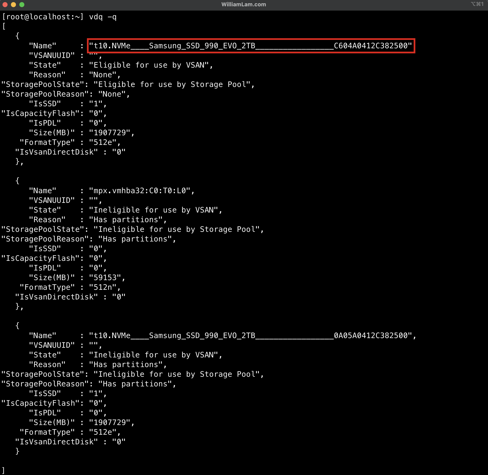

After creating the bootable ESXi installer on your USB device, copy your modified `KS.CFG` into the root directory of the USB device.

Now, navigate into the USB device under `EFI/BOOT` and edit `BOOT.CFG` and update the `kernelopt` so it matches the followingn which will run our KS.CFG instead of the interactive installation:

```code
bootstate=0
title=Loading ESXi installer
timeout=5
prefix=
kernel=/b.b00
kernelopt=ks=usb:/KS.CFG
modules=/jumpstrt.gz --- /useropts.gz --- /features.gz --- /k.b00 --- /uc_intel.b00 --- /uc_amd.b00 --- /uc_hygon.b00 --- /procfs.b00 --- /vmx.v00 --- /vim.v00 --- /tpm.v00 --- /sb.v00 --- /s.v00 --- /atlantic.v00 --- /bcm_mpi3.v00 --- /bnxtnet.v00 --- /bnxtroce.v00 --- /brcmfcoe.v00 --- /cndi_igc.v00 --- /dwi2c.v00 --- /elxiscsi.v00 --- /elxnet.v00 --- /i40en.v00 --- /iavmd.v00 --- /icen.v00 --- /igbn.v00 --- /intelgpi.v00 --- /ionic_cl.v00 --- /ionic_en.v00 --- /irdman.v00 --- /iser.v00 --- /ixgben.v00 --- /lpfc.v00 --- /lpnic.v00 --- /lsi_mr3.v00 --- /lsi_msgp.v00 --- /lsi_msgp.v01 --- /lsi_msgp.v02 --- /mtip32xx.v00 --- /ne1000.v00 --- /nenic.v00 --- /nfnic.v00 --- /nhpsa.v00 --- /nipmi.v00 --- /nmlx5_cc.v00 --- /nmlx5_co.v00 --- /nmlx5_rd.v00 --- /ntg3.v00 --- /nvme_pci.v00 --- /nvmerdma.v00 --- /nvmetcp.v00 --- /nvmxnet3.v00 --- /nvmxnet3.v01 --- /pvscsi.v00 --- /qcnic.v00 --- /qedentv.v00 --- /qedrntv.v00 --- /qfle3.v00 --- /qfle3f.v00 --- /qfle3i.v00 --- /qflge.v00 --- /rdmahl.v00 --- /rshim_ne.v00 --- /rshim.v00 --- /rste.v00 --- /sfvmk.v00 --- /smartpqi.v00 --- /vmkata.v00 --- /vmksdhci.v00 --- /vmkusb.v00 --- /vmw_ahci.v00 --- /bmcal.v00 --- /clusters.v00 --- /crx.v00 --- /drivervm.v00 --- /elx_esx_.v00 --- /btldr.v00 --- /dvfilter.v00 --- /esx_ui.v00 --- /esxupdt.v00 --- /tpmesxup.v00 --- /weaselin.v00 --- /esxio_co.v00 --- /infravis.v00 --- /loadesx.v00 --- /lsuv2_hp.v00 --- /lsuv2_in.v00 --- /lsuv2_ls.v00 --- /lsuv2_nv.v00 --- /lsuv2_oe.v00 --- /lsuv2_oe.v01 --- /lsuv2_sm.v00 --- /native_m.v00 --- /qlnative.v00 --- /trx.v00 --- /vcls_pod.v00 --- /vdfs.v00 --- /vds_vsip.v00 --- /vmware_e.v00 --- /hbrsrv.v00 --- /vsan.v00 --- /vsanheal.v00 --- /vsanmgmt.v00 --- /tools.t00 --- /xorg.v00 --- /gc.v00 --- /imgdb.tgz --- /basemisc.tgz --- /resvibs.tgz --- /esxiodpt.tgz --- /imgpayld.tgz
build=8.0.3-0.35.24280767
updated=0
```

5. Plug the USB device into your system and power on to begin the ESXi installation. If you are performing a scripted installation, you may come across this warning, you can ignore and either wait or press enter to continue with the installation

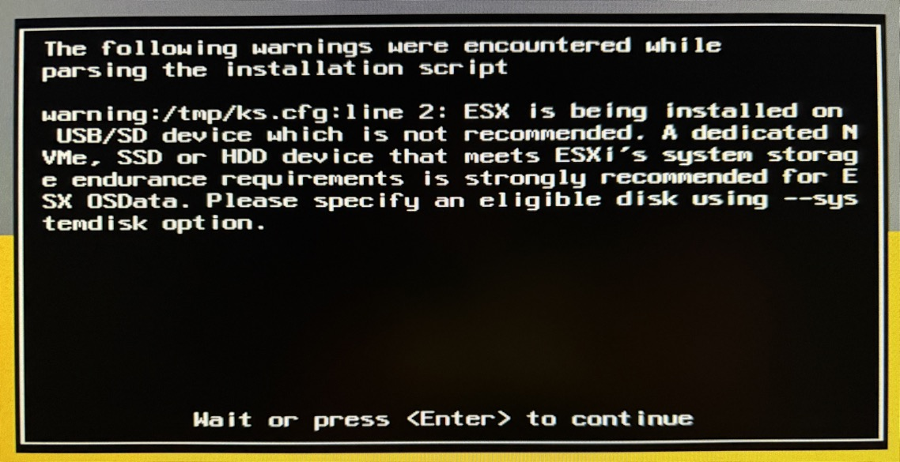

6. Once the ESXi reboot (there is a secondary reboot as part of the ESXi scripted installation), you should be able to login to your ESXi host using the FQDN and see something like the following:

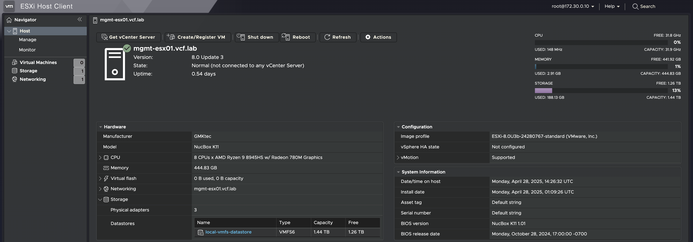

7. Install the [vSAN ESA Mock VIB](https://williamlam.com/2025/02/vsan-esa-hardware-mock-vib-for-physical-esxi-deployment-for-vmware-cloud-foundation-vcf.html) which will allow us to use non-HCL NVMe devices for configuring vSAN ESA

```
esxcli network firewall ruleset set -e true -r httpClient
esxcli software acceptance set --level CommunitySupported
esxcli software vib install -v https://github.com/lamw/nested-vsan-esa-mock-hw-vib/releases/download/1.0/nested-vsan-esa-mock-hw.vib --no-sig-check
/etc/init.d/vsanmgmtd restart
```

8. (Optional) If you do not already have a DNS server running within your enviornment or would like to localized this setup, you can deploy a VMware PhotonOS VM and use that as your DNS server. You can use my [unbound.conf](config/unbound.conf) as an exmaple setup.

```
tdnf update -y
tdnf install unbound -y
systemctl stop iptables
systemctl disable iptables
systemctl enable unbound
systemctl restart unbound

rm -f /etc/resolv.conf
cat > /etc/resolv.conf <<EOF
nameserver 172.30.0.2
search vcf.lab
EOF
```

9. Deploy the Cloud Builder Appliance by using the ESXi Embedded Host Client or you can automate (recommend) it by using following script [deploy_vcf_cloudbuilder.sh](scripts/deploy_vcf_cloudbuilder.sh).

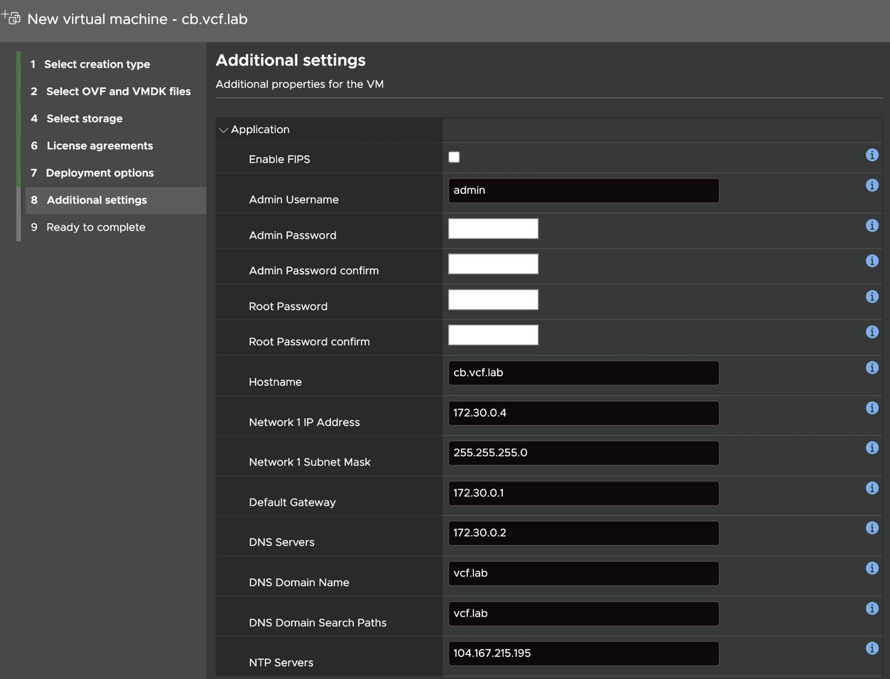

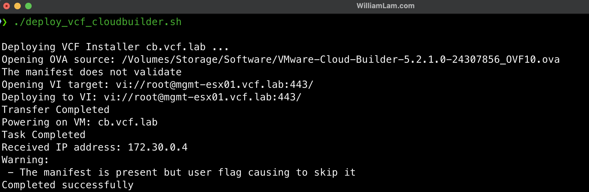


10. After Cloud Builder is up and running, we will need to make a few configuration changes. SCP the [setup_vmware_cloud_builder_for_one_node_management_domain.sh](scripts/setup_vmware_cloud_builder_for_one_node_management_domain.sh) to the Cloud Builder appliance using the `admin` username and the credentials configured from the previous step.

You will need to run the script as the `root` user by switching to that user and provide the root credentials when prompted after running the following command:

```
su -
```

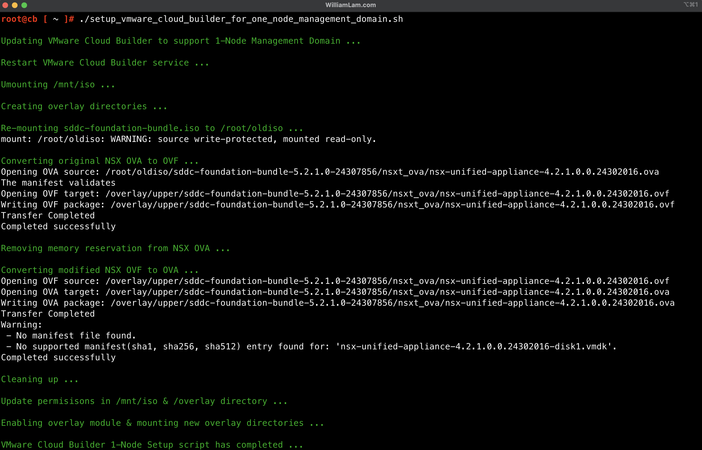

11. We are now ready to deploy the VCF Management Domain using Cloud Builder. Edit the [vcf52-management-domain-example.json](config/vcf52-management-domain-example.json) and replace the values with your desired configuration.

We will use the Cloud Builder UI interface (open a browser to the FQDN of Cloud Builder) to validate `vcf52-management-domain-example.json` configuration. The only error that you should see is 10GbE NIC pre-check which will fail and this is to be expected. If you have any other errors, please resolve those and re-submit your JSON for validation.

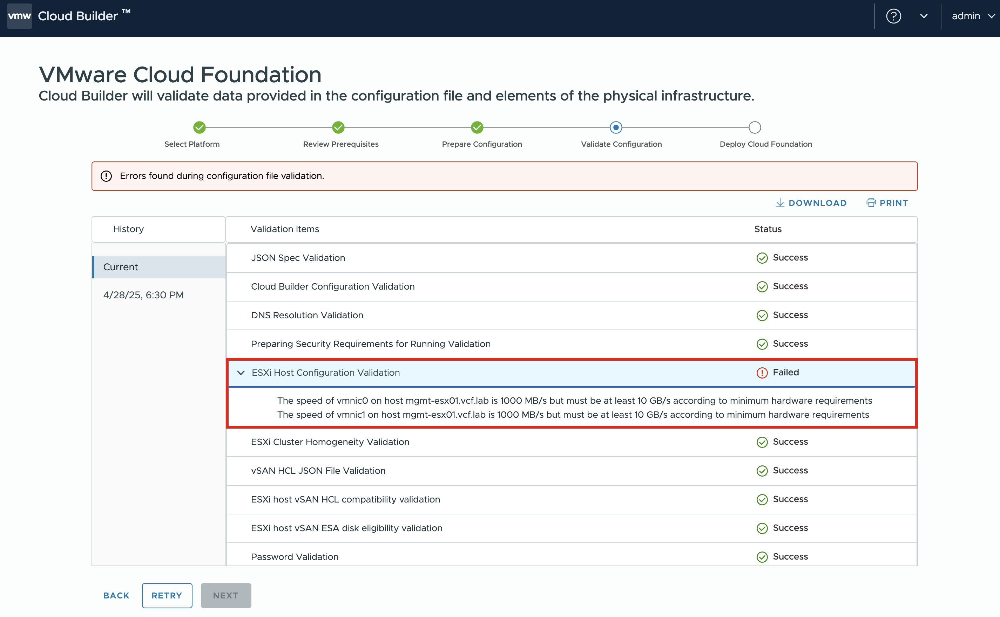

To bypass the 10GbE NIC pre-check, we will need to deploy the VCF Management Domain using the Cloud Builder REST API instead of the UI. Update the [deploy-vcf-mgmt-domain.ps1](scripts/deploy-vcf-mgmt-domain.ps1) PowerShell script with your desired values.

Run the PowerShell as shown below and if the operation was successfull, you can now use the Cloud Builder UI to monitor the progress of your deployment.
```console
./deploy-vcf-mgmt-domain.ps1
```

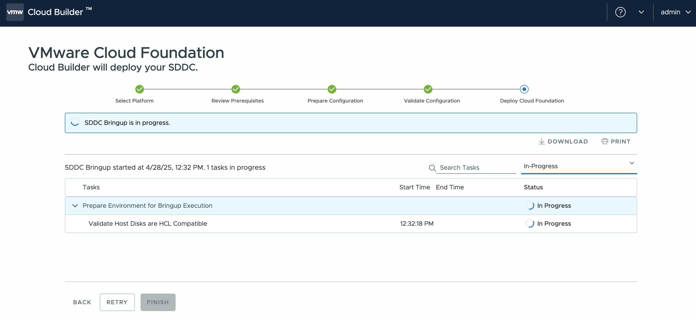

12. The Cloud Builder will encounter an expected failure when it attempts to deploy NSX Manager due to default VM Storage Policy set for vSAN ESA.

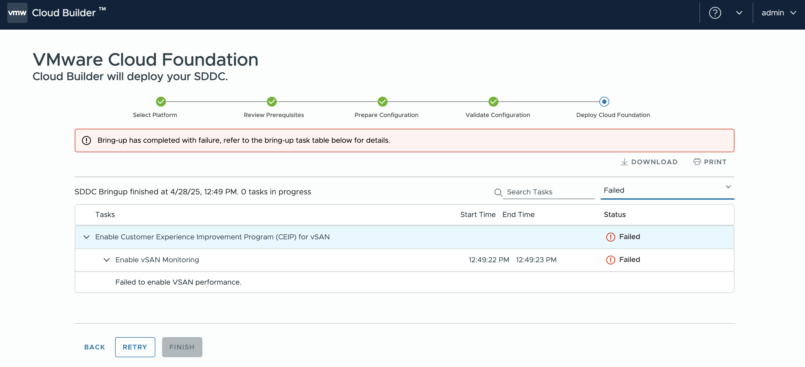

Open a new browser window to the FQDN of the deployed vCenter Server and navigate to the VM Storage Policies and locate `vcf-m01-cl01 - Optimal Datastore Default Policy - RAID1` and set the value for "Failures to tolerate" to `No data redundancy` and apply the change.

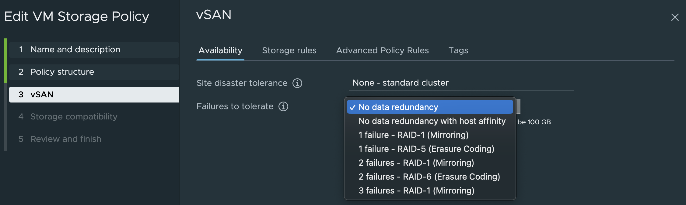

Navigate back to the Cloud Builder UI and then retry the deployment which will resume and now continue the deployment.

Here is what the Cloud Builder UI should look like upon completing the VCF Management Domain bring-up.

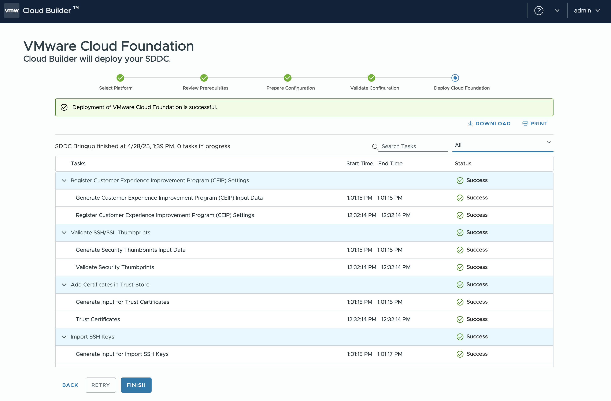

Once you click finished, you will have option to login to SDDC Manager

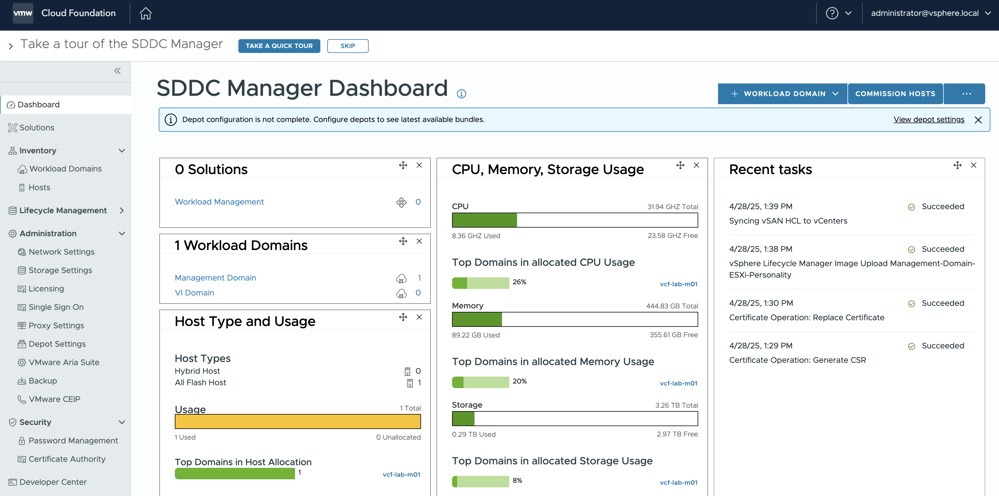

Here is a screenshot of the ESXi host and expected inventory once the VCF Management Domain has been deployed. At this point, you can shutdown the Cloud Builder VM as it is no longer required.

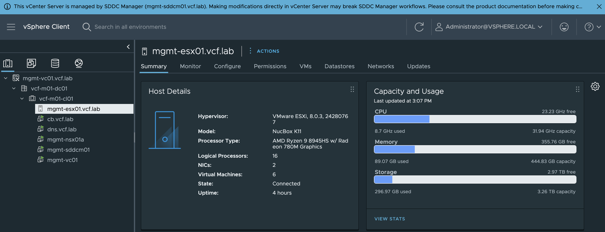

To get rid of the the Insufificent vSphere HA warning in vSphere UI, you can edit the vSphere HA setings and disable Admission Control.

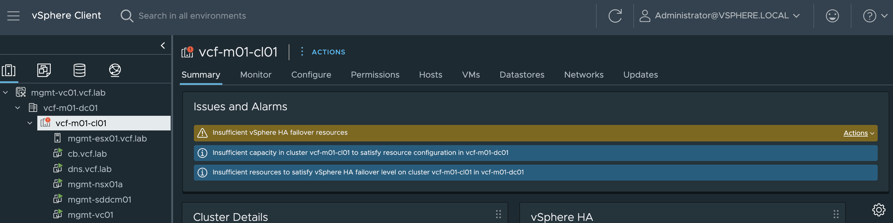

## Additional Deployments

### Workload Domain

If you wish to deploy a Workload Domain, you will need to deploy Nested ESXi VM(s) due to the 10GbE pre-check requirement. After [comissioning additional ESXi hosts](https://techdocs.broadcom.com/us/en/vmware-cis/vcf/vcf-5-2-and-earlier/4-5/administering/host-management-admin/commission-hosts-admin.html), you can deploy [Worklaod Domain using the SDDC Manager UI](https://techdocs.broadcom.com/us/en/vmware-cis/vcf/vcf-5-2-and-earlier/4-5/administering/working-with-workload-domains-admin/about-virtual-infrastructure-workload-domains-admin/deploy-a-vi-workload-domain-using-the-sddc-manager-ui-admin.html) or [SDDC Manager API](https://techdocs.broadcom.com/us/en/vmware-cis/vcf/vcf-5-2-and-earlier/4-5/administering/working-with-workload-domains-admin/about-virtual-infrastructure-workload-domains-admin/deploy-a-vi-workload-domain-using-the-vmware-cloud-foundation-api-admin.html) which you can refer to [vcf52-workload-domain-example.json](config/vcf52-workload-domain-example.json) as a working example.

### Edge Cluster for Workload Domain

For additional networking capablitites, you can deploy an [NSX Edge Cluster for your Workload Domain](https://techdocs.broadcom.com/us/en/vmware-cis/vcf/vcf-5-2-and-earlier/4-5/administering/deploying-nsx-edge-clusters-admin.html which will require at least two ESXi hosts within the Workload Domain. You can deploy using the SDDC Manager UI or API, you can refer to [wld-edge-cluster.json](config/wld-edge-cluster.json) as a working example when using the API.

### Aria Suite

If you wish to deploy Aria Suite (Aria Identity, Aria Operations, Aria Operations for Logs and Aria Operations for Network) using Aria Lifecycle Manager, you can download it from [HERE](https://support.broadcom.com/group/ecx/productfiles?subFamily=VMware%20Aria%20Suite&displayGroup=VMware%20Aria%20Suite%20-%20Enterprise&release=2019&os=&servicePk=202420&language=EN)

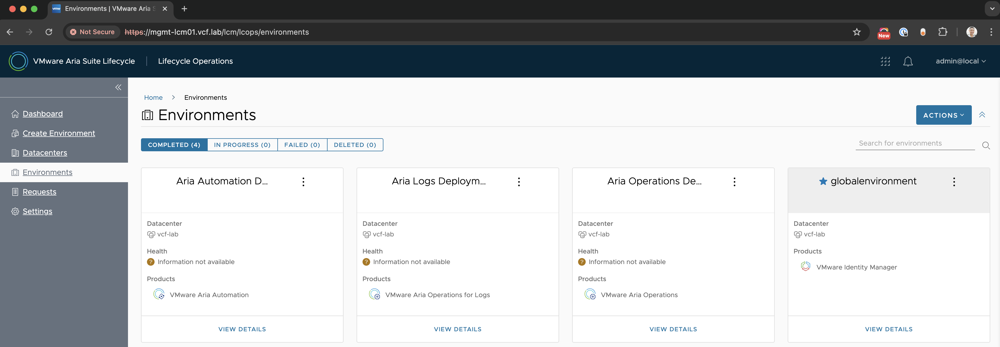

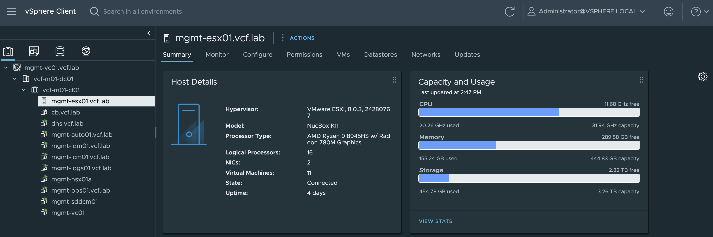

## Blog References

* [VMware Cloud Foundation with a single ESXi host for Management Domain?](https://williamlam.com/2023/02/vmware-cloud-foundation-with-a-single-esxi-host-for-management-domain.html)
* [VMware Cloud Foundation with a single ESXi host for Workload Domain?](https://williamlam.com/2023/02/vmware-cloud-foundation-with-a-single-esxi-host-for-workload-domain.html)
* [Removing NSX CPU/Memory reservations when deploying a VMware Cloud Foundation (VCF) Management or Workload Domain](https://williamlam.com/2023/02/removing-nsx-cpu-memory-reservations-when-deploying-a-vmware-cloud-foundation-vcf-management-or-workload-domain.html)
* [VMware Cloud Foundation on Intel NUC?](https://williamlam.com/2023/02/vmware-cloud-foundation-on-intel-nuc.html)
* [VMware Cloud Foundation 5.0 running on Intel NUC](https://williamlam.com/2023/06/vmware-cloud-foundation-5-0-running-on-intel-nuc.html)
* [Sharing a single NVMe device with NVMe Tiering, ESXi-OSDATA & VMFS Datastore?](https://williamlam.com/2024/12/sharing-a-single-nvme-device-with-nvme-tiering-esxi-osdata-vmfs-datastore.html)
